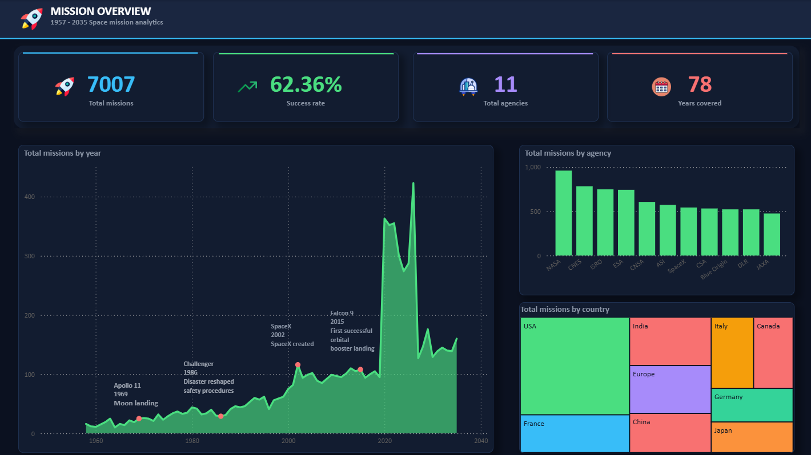
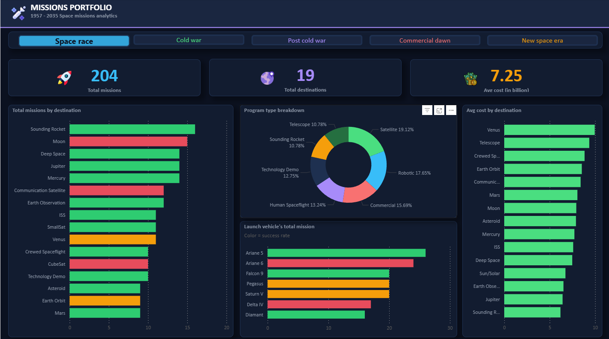
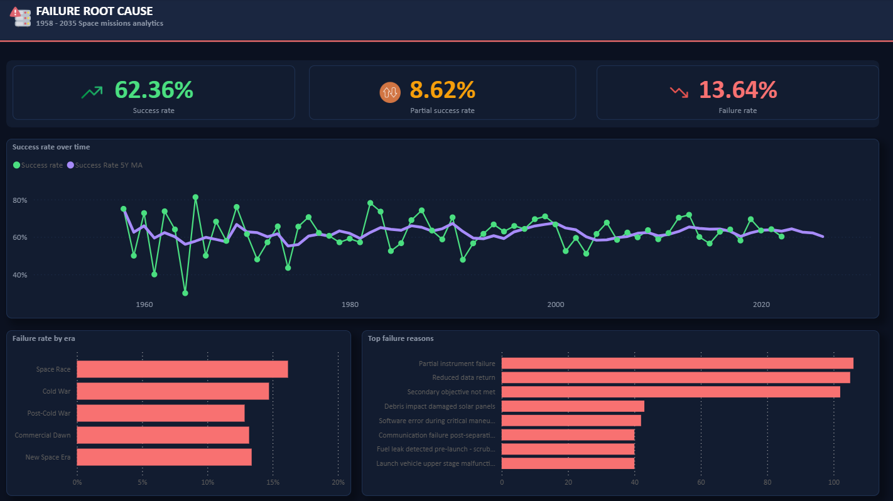

# 🚀 Space Missions Analytics Pipeline (1957–2035)

<p align="center">
  
</p>

<p align="center">
<b>End-to-End Data Analytics Pipeline</b><br>
Python • PostgreSQL • Statistical Analysis • Power BI
</p>

<p align="center">


</p>

An end-to-end analytics pipeline exploring nearly seven decades of space exploration, from raw mission records to an interactive Power BI dashboard.

The project investigates how mission reliability, commercial participation, and exploration priorities have evolved over time. Rather than relying solely on descriptive charts, the analysis combines a PostgreSQL data warehouse with statistical hypothesis testing and historical trend analysis to distinguish genuine patterns from visual impressions.

The pipeline mirrors a production-style analytics workflow: raw data is validated before loading, transformed into a PostgreSQL star schema, and queried consistently across Python notebooks and Power BI.

---

## 📌 Business Questions

This project aims to answer questions such as:

- Has mission reliability improved over the history of space exploration?
- Which agencies and countries have historically achieved the highest mission success?
- How has commercial spaceflight changed the global launch landscape?
- Which mission categories are the most technically challenging?
- Which operational and historical factors are most strongly associated with mission success?

---

## 📌 Project Status

| Phase | Status |
|---|---|
| ETL & PostgreSQL Warehouse | ✅ Complete |
| Data Quality Audit | ✅ Complete |
| Exploratory Data Analysis | ✅ Complete |
| Historical / Era Analysis | ✅ Complete |
| Power BI Dashboard | ✅ Complete |

---

# 📊 Dashboard Preview


## Executive Overview


---

## Mission Portfolio



---

## Mission Reliability




---


## 🔍 Key Findings

- Historical mission reliability has steadily improved from the Space Race to the New Space Era.
- NASA combines the largest mission portfolio with one of the strongest historical success rates.
- Mission category has a greater influence on historical success than agency type alone.
- Commercial launch activity has increased substantially since the early 2000s.
- Statistical testing confirms that mission outcome is significantly associated with both country and mission category.

---

## 📂 Dataset

| Property | Detail |
|---|---|
| Source | [Kaggle](https://www.kaggle.com/datasets/maulikgajera/global-space-missions-dataset-19502025) |
| Coverage | 1958–2035 |
| Rows | ~7000 missions after cleaning and validation |
| Columns | 26 |

### Dataset Columns

| Column | Type | Description |
|---|---|---|
| `mission_id` | String | Unique mission identifier |
| `mission_name` | String | Official mission name |
| `program_type` | String | Mission program type (Robotic, Human Spaceflight, Satellite) |
| `mission_category` | String | High-level category (Moon, Mars, Earth Orbit, etc.) |
| `sub_category` | String | Specific mission type (Orbiter, Lander, Rover, CubeSat) |
| `destination` | String | Target destination or operational region |
| `status` | String | Mission status (Success, Failed, Partial Success, Ongoing, Upcoming) |
| `mission_phase` | String | Temporal classification (Past, Ongoing, Future) |
| `crew_type` | String | Crewed or Uncrewed |
| `data_returned` | String | Whether scientific or operational data was returned |
| `failure_reason` | String | Failure description for unsuccessful missions |
| `cost_usd_billion` | Float | Mission cost in billions of USD |
| `duration_days` | Float | Mission duration in days |
| `agency_name` | String | Responsible space agency |
| `country_region` | String | Country or region associated with the mission |
| `agency_type` | String | Government or Private |
| `launch_vehicle` | String | Launch vehicle used |
| `launch_site` | String | Launch facility or spaceport |
| `launch_date` | Date | Mission launch date |
| `launch_year` | Integer | Year extracted from launch date |
| `launch_decade` | String | Launch decade (e.g. 1960s, 2000s) |
| `end_date` | Date | Mission end date (NULL for ongoing/future missions) |
| `end_year` | Integer | Year extracted from end date |
| `end_decade` | String | End decade |
| `objective` | String | Primary mission objective |
| `key_achievement` | String | Major accomplishment or milestone |
| `mission_outcome_detail` | String | Detailed outcome description |
| `reference_url` | String | Source URL used for verification |

---

## 🧱 Project Architecture

This project is built as a real analytics pipeline rather than a single notebook: raw data is cleaned and validated in Python, transformed into a star-schema structure, loaded into PostgreSQL, and queried directly from the warehouse for every downstream notebook.

The pipeline separates concerns deliberately:

- Raw data ingestion
- Data cleaning and validation
- Schema transformation
- Database loading
- Analytical querying (every notebook reads from PostgreSQL, not the raw CSV)

## 📁 Repository Structure

```text
space_mission_analysis/
│
├── dashboard/
│   └── space_missions.pbix
│
├── data/
│   └── raw/
│       └── space_missions.csv
│
├── images/
│   ├── Page1.png
│   ├── Page2.png
│   └── Page3.png
│
├── logs/
        └──.gitkeep
│
├── notebooks/
│   ├── 01_data_quality_audit.ipynb
│   ├── 02_eda.ipynb
│   └── 03_historical_analysis.ipynb
│
├── sql/
│   └── schema.sql
│
├── src/
│   ├── config.py
│   ├── db.py
│   ├── etl_load.py
│   └── logger.py
│
├── requirements.txt
├── .gitignore
├── .env.example
└── README.md

---

## 🏗️ Pipeline Overview


                 Raw CSV Dataset
                        │
                        ▼
          Data Cleaning & Validation
                 (Python / pandas)
                        │
                        ▼
            PostgreSQL Star Schema
                        │
          ┌─────────────┴─────────────┐
          ▼                           ▼
 EDA and statistical Analysis            Power BI Dashboard
 (Jupyter Notebooks)           (Interactive Report)


Every notebook and dashboard queries the PostgreSQL warehouse rather than the raw dataset, ensuring that all analysis is performed on the same validated source of truth.

---
## 🗄️ Database Design

The dataset is transformed into a **star schema PostgreSQL warehouse**, designed for analytical queries and direct Power BI integration.

```
                    ┌─────────────────┐
                    │    dim_date     │
                    └────────┬────────┘
                             │
┌────────────────┐   ┌───────┴──────────┐   ┌─────────────────┐
│  dim_agency    │───│  fact_missions   │───│  dim_launch     │
└────────────────┘   └───────┬──────────┘   └─────────────────┘
                             │
                     ┌───────┴───────────┐
                     │ dim_mission_meta  │
                     └───────────────────┘
```

### Tables Overview

| Table | Rows (approx.) | Purpose |
|---|---|---|
| `fact_missions` | ~4,630 | Core mission facts |
| `dim_date` | ~7,648 | Calendar dimension |
| `dim_agency` | ~11 | Agency information |
| `dim_launch` | ~121 | Launch vehicles & sites |
| `dim_mission_meta` | ~4,630 | Mission descriptions |
| `bridge_crew` | varies | Crew member bridge table |
| `bridge_partners` | varies | Partner agency bridge table |

---

## ⚙️ ETL Pipeline (`etl_load.py`)

1. Load raw CSV
2. Clean & standardise columns
3. Parse duration text into numeric days (`duration_days`)
4. Validate data integrity rules (e.g. launch date vs. agency founding year)
5. Build dimension tables (`dim_date`, `dim_agency`, `dim_launch`, `dim_mission_meta`)
6. Build fact table (`fact_missions`)
7. Build bridge tables (`bridge_crew`, `bridge_partners`)
8. Load all tables into PostgreSQL with FK-safe ordering and indexing

---

## 🧹 Key Data Cleaning Decisions

| Issue | Action |
|---|---|
| Sentinel strings (`n/a`, `none`, etc.) | Converted to NULL |
| Duration text values (e.g. "3.9 years") | Parsed into `duration_days` |
| Cost in millions | Converted to billions |
| Launch date before agency founding year | Removed during validation |
| Date parsing mismatch (DD/MM/YYYY) | Fixed with `dayfirst=True`, resolved ~3,000 null dates |
| Structural nulls (e.g. no end date for ongoing missions) | Preserved intentionally |
| Duplicate missions | Retained as valid distinct entries |

---

## 📓 Notebooks

| Notebook | What it covers |
|---|---|
| `01_Data Quality Audit.ipynb` | Post-ETL data quality checks — completeness, consistency, referential integrity against the PostgreSQL warehouse |
| `02_Exploratory Data Analysis.ipynb` | Full exploratory analysis with statistical testing — Chi-square independence tests, Welch's t-tests for unequal variances, Pearson correlation |
| `03_Historical_Analysis.ipynb` | Era-based historical analysis: annotated timeline, 5-year rolling success rates, government vs. private sector shift, agency dominance heatmap by era, cost trends over time, mission category shifts by decade |

Every notebook queries the PostgreSQL warehouse directly via `src/db.py` (`load_missions_full()`), not the raw CSV — this keeps analysis consistent with the cleaned, validated data model.

---

## 📈 Statistical Methods

The analysis combines exploratory techniques with formal statistical testing.

| Method | Purpose |
|---|---|
| Chi-square Test of Independence | Test associations between categorical variables (e.g. country vs. mission outcome) |
| Welch's t-test | Compare means between groups with unequal variances |
| Pearson Correlation | Measure linear relationships between continuous variables |
| Rolling Averages | Identify long-term historical trends while reducing yearly volatility |
| Descriptive Statistics | Summarize mission costs, durations, and operational characteristics |

---

## 📈 Power BI Dashboard

The interactive report is available at:

```text
dashboard/space_missions.pbix
```

The report connects directly to analytical SQL views built on the PostgreSQL warehouse rather than exported CSV files.

### Features

- Executive KPI dashboard
- Interactive bookmarks
- Historical timeline annotations
- Conditional formatting
- Cross-filtering between visuals
- Multi-page analytical report

---
## 📖 Dashboard Walkthrough

### Executive Overview
Provides a high-level summary of historical space exploration through KPIs, launch trends, and major milestones.

### Mission Portfolio
Explores destinations, launch vehicles, mission categories, and cost distribution with interactive filtering by historical era.

### Mission Reliability
Focuses on mission outcomes, failure causes, and the long-term evolution of mission success across the history of space exploration.

---

## 🛠️ Requirements

```
pandas
numpy
sqlalchemy
psycopg2-binary
python-dotenv
matplotlib
seaborn
scipy
jupyter
```

Install dependencies:

```bash
pip install -r requirements.txt
```

---

## 🚀 Quickstart

### 1. Setup environment

```bash
git clone https://github.com/ahmedmohi0/space_mission_analysis.git
cd space_mission_analysis
python -m venv venv
```

**Activate environment**

Windows:
```bash
venv\Scripts\activate
```

Mac/Linux:
```bash
source venv/bin/activate
```

Install dependencies:
```bash
pip install -r requirements.txt
```

### 2. Configure database

Copy `.env.example` to `.env` and update the values.:

```
DB_HOST=localhost
DB_PORT=5432
DB_NAME=space_missions
DB_USER=your_user
DB_PASSWORD=your_password
```

### 3. Create schema

```bash
psql -U your_user -d space_missions -f sql/schema.sql
```

### 4. Run ETL pipeline

```bash
python src/etl_load.py
```

### 5. Open notebooks

```bash
jupyter notebook notebooks/
```

---

## 📊 Tech Stack

| Layer | Technology |
|---|---|
| Data Storage | PostgreSQL |
| ETL & Analysis | Python, pandas, SQLAlchemy |
| Statistical Testing | scipy.stats |
| Visualization | matplotlib, seaborn |
| BI Reporting | Power BI |
| Version Control | Git & GitHub |

---

## 📁 Key Files

| File                            | Purpose                        |
| ------------------------------- | ------------------------------ |
| `sql/schema.sql`                | Database schema and SQL views  |
| `src/etl_load.py`               | ETL pipeline                   |
| `src/db.py`                     | Database utilities             |
| `src/logger.py`                 | Logging                        |
| `src/config.py`                 | Configuration                  |
| `dashboard/space_missions.pbix` | Interactive Power BI dashboard |

---
## 👤 Author

**Ahmed Mohi Eldin Aly**

Data Analytics | Python | SQL | PostgreSQL | Power BI | Statistics

This project was developed as part of my data analytics portfolio to demonstrate end-to-end analytical workflows, statistical reasoning, data warehousing, and interactive dashboard development.